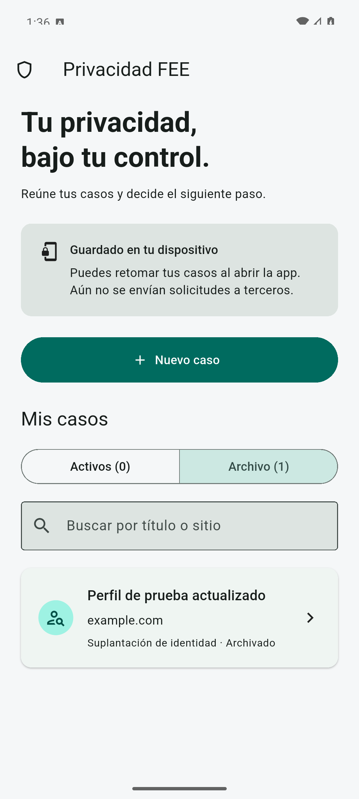
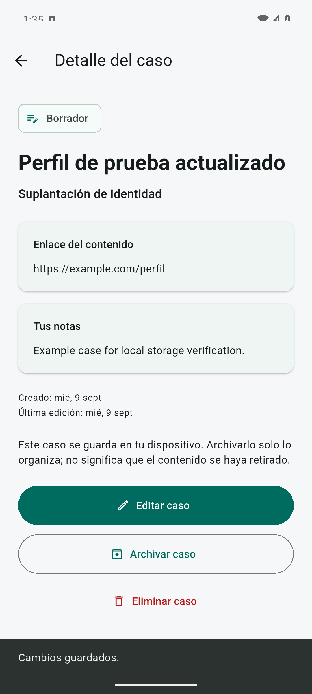

# App móvil · Hackaton-FEE

Aplicación Flutter para iOS y Android que organiza casos de privacidad en el dispositivo. El concepto está en [documentation/concepto-central-plataforma.md](https://github.com/Hackaton-FEE/documentation/blob/main/concepto-central-plataforma.md); este repositorio distingue la visión del producto de las capacidades implementadas.

## Qué funciona

- Crear, consultar y editar casos con título, enlace HTTP/HTTPS, categoría y notas.
- Buscar casos y organizarlos como borradores o archivados; restaurarlos o eliminarlos.
- Conservar los casos entre sesiones mediante almacenamiento local: un JSON versión 1 por registro, usando `flutter_secure_storage` 10.3.2 con Keychain en iOS y almacenamiento cifrado en Android.
- Separar modelos inmutables, repositorio asíncrono, adaptador nativo y presentación con `ChangeNotifier` e inyección por constructor.
- Mostrar errores de carga o escritura sin confirmar cambios que no se guardaron ni borrar automáticamente datos corruptos.

Los estados **borrador** y **archivado** solo organizan información local: no indican que una plataforma recibió una solicitud ni retiró contenido. La app no conecta al backend, no recibe imágenes y no envía reportes. Las categorías sirven para ordenar los casos; seleccionar contenido íntimo no procesa imágenes ni determina una infracción.

El almacenamiento no incorpora autenticación o bloqueo propio de la app, sincronización, exportación ni recuperación garantizada desde backups. Tampoco es una arquitectura de conocimiento cero. La configuración y sus límites están en [arquitectura](docs/architecture.md); usa información ficticia para pruebas.

## Inicio rápido

Capturas de Android con datos ficticios; el archivo conserva su contenido después de cerrar el proceso y abrir la app:

 

Requisitos: Flutter **3.47.2** (Dart **3.13.2** incluido), Git y herramientas de la plataforma. `.fvmrc` fija la versión si el equipo usa FVM; FVM es opcional. Las dependencias resueltas están en `pubspec.lock`; `flutter_secure_storage` está fijado en 10.3.2 y Android usa `compileSdk` 36.

```bash
git clone https://github.com/Hackaton-FEE/app.git
cd app
flutter doctor
flutter pub get --enforce-lockfile
flutter devices
flutter run -d <device-id>
```

Para Android, instala Android Studio/SDK y Java 17 o una versión compatible con el Gradle del proyecto. En Linux se puede compilar Android, pero no iOS. Para iOS utiliza un Mac con Xcode, sus herramientas de línea de comandos y un simulador instalado.

```bash
# Android, compilación de desarrollo
flutter build apk --debug

# Solo macOS con Xcode: simulador iOS, sin firma de distribución
flutter build ios --simulator --debug
```

El APK queda en `build/app/outputs/flutter-apk/app-debug.apk`. Para un iPhone físico hay que configurar el equipo de Apple y la firma en Xcode. Los identificadores generados con el prefijo `org.hackatonfee` son de desarrollo: confirmarlos antes de publicar. Android release no reutiliza la clave debug; las credenciales de distribución se configurarán fuera del repositorio.

## Estructura

```text
lib/
  main.dart
  app/                      # Composición de dependencias y tema
  features/cases/
    domain/                 # Modelos inmutables, validación y contrato async
    data/                   # Repositorio persistente y adaptador de almacenamiento
    presentation/           # Controlador y pantallas
test/                       # Pruebas de dominio y widgets
integration_test/           # Persistencia mediante el plugin nativo
android/                    # Proyecto nativo Android
ios/                        # Proyecto nativo iOS
rules/                      # Reglas mantenidas por el equipo
skills/                     # Guías por tarea para asistentes de IA
docs/                       # Arquitectura y forma de trabajo
.github/workflows/          # Validación Flutter, Android e iOS manual
```

## Validación

```bash
dart format --output=none --set-exit-if-changed lib test integration_test
flutter analyze
flutter test
flutter build apk --debug
```

GitHub Actions ejecuta `Flutter checks` y `Android build` en pushes y pull requests. El APK debug se conserva siete días como artifact. `iOS simulator build` se ejecuta manualmente desde Actions en un runner macOS: prueba la persistencia nativa de Keychain en un iPhone simulado y compila la app. No publica nada en App Store y no se considera verificado hasta que su ejecución pase. Usar ese runner consume la cuota correspondiente de GitHub Actions.

Las pruebas unitarias y de widgets usan almacenamiento de prueba. La prueba de integración necesita un dispositivo o emulador y ejercita el plugin real; recrear el repositorio no equivale a reiniciar el proceso. Sigue [la guía de pruebas](docs/testing.md) para ejecutarla y comprobar cierre/reapertura en Android sin desinstalar la app.

## Dos ingenieros y desarrollo con IA

Leer [CONTRIBUTING.md](CONTRIBUTING.md), [AGENTS.md](AGENTS.md) y [flujo del equipo](docs/workflow.md). `main` es la base estable; `work/engineer-1` y `work/engineer-2` son las ramas iniciales de trabajo. Cada PR debe tener validación y revisión del otro ingeniero. GitHub Free no aplica protección de ramas en repositorios privados: estas reglas son una convención del equipo hasta habilitar un plan compatible.

El [servidor](https://github.com/Hackaton-FEE/server) es independiente. Su contrato inicial es `GET /api/v1/health`; esta app todavía no lo consume. No incluir claves privadas en Dart, `--dart-define`, assets ni código nativo: cualquier valor distribuido en una app puede extraerse.

## Siguientes entregas

1. Recibir enlaces desde Compartir en Android y una Share Extension de iOS, reutilizando la validación y definiendo cómo coordinar escrituras entre procesos.
2. Definir autenticación, bloqueo de acceso y qué ocurre con los casos locales al iniciar/cerrar sesión o cambiar de cuenta.
3. Acordar el contrato de casos con el servidor e integrar sincronización, conflictos y errores, conservando la diferencia entre estados locales y resultados externos.
4. Preparar una solicitud revisable para un canal concreto. El envío y su seguimiento requieren una integración y evidencia propias.

Referencias de implementación: [recomendaciones de arquitectura de Flutter](https://docs.flutter.dev/app-architecture/recommendations) y [documentación de flutter_secure_storage](https://pub.dev/packages/flutter_secure_storage).
