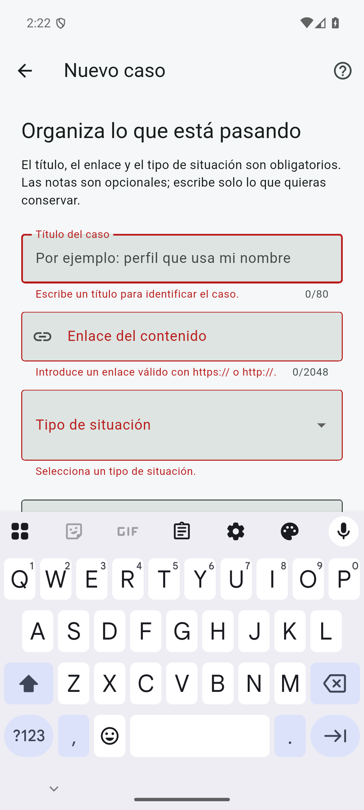
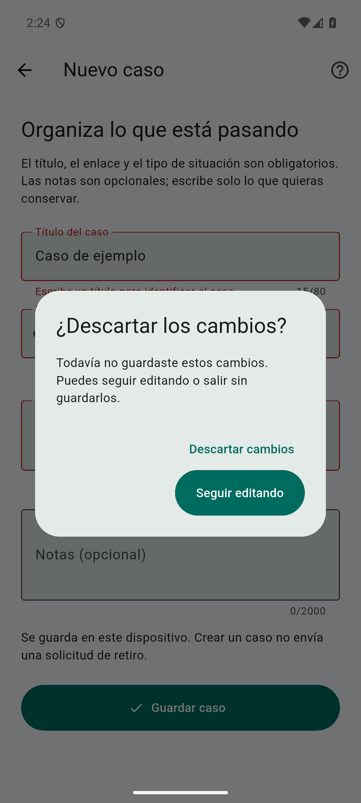
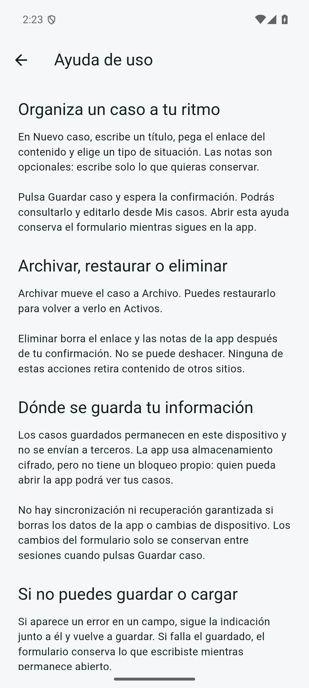
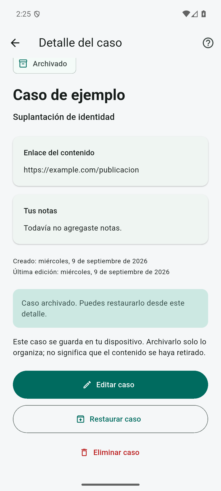
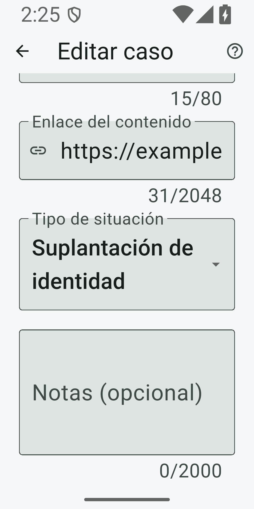

# Accesibilidad y atención al usuario

Revisión dirigida, consultada el **9 de septiembre de 2026**. Compara la app en `508aefb` con los cambios de esta entrega. Su propósito es justificar decisiones verificables para gestionar casos locales: comprender las acciones, corregir errores, conservar el trabajo y utilizar tecnologías de asistencia. No constituye una revisión sistemática, una certificación de accesibilidad ni una validación clínica.

## Método y alcance

Se seleccionaron seis fuentes primarias de accesibilidad: el estándar WCAG 2.2, su interpretación para software no web, orientación cognitiva y documentación oficial de Flutter, Apple y Android. Se consultó el contenido de las páginas; para Apple se leyó la representación JSON oficial del mismo documento porque su página depende de JavaScript. La selección privilegió criterios que pueden relacionarse con formularios, listas, navegación, mensajes y controles de la app.

La revisión de atención al usuario incorporó tres publicaciones originales con texto completo disponible: dos estudios empíricos de seguridad informática y violencia de pareja, y un marco conceptual de interacción humano-computadora. Se leyeron métodos, resultados y límites. Se descartó tratar recomendaciones comerciales o resúmenes de terceros como evidencia de efectividad. Las decisiones de producto que trasladan estos resultados a FEE son inferencias de diseño, no resultados observados en nuestra población.

Hay sesgos de selección y disponibilidad: predominan fuentes en inglés, plataformas dominantes e investigaciones estadounidenses. No se agotaron bases bibliográficas, no hubo revisión doble con protocolo registrado y no se estimaron efectos combinados. Tampoco participaron usuarios de FEE en esta revisión. La evidencia no permite afirmar eficacia para México, para todas las discapacidades o para toda situación de violencia digital.

## Fuentes y evidencia aplicable

| Fuente primaria | Naturaleza y aporte | Aplicabilidad y límites |
| --- | --- | --- |
| [W3C, WCAG 2.2](https://www.w3.org/TR/WCAG22/) | Recomendación normativa para contenido web. Define criterios comprobables sobre percepción, operación, comprensión y semántica. | Referencia técnica; no certifica por sí sola una app nativa. Los umbrales pertinentes aparecen debajo. |
| [W3C, WCAG2ICT](https://www.w3.org/TR/wcag2ict-22/) | Nota informativa que interpreta criterios A/AA de WCAG para documentos y software no web. | No añade requisitos normativos ni cubre toda la accesibilidad nativa. Orienta a comprobar interoperabilidad con teclado y servicios del sistema, además del código de interfaz. |
| [W3C, COGA: Making Content Usable](https://www.w3.org/TR/coga-usable/) | Guía complementaria sobre necesidades cognitivas y de aprendizaje: lenguaje literal, ayuda localizable y recuperación sin repetir trabajo. | Sustenta preservar edición y explicar consecuencias. No es un requisito adicional de conformidad WCAG ni demuestra que un diálogo específico funcione para todas las personas. |
| [Flutter, Accessibility testing](https://docs.flutter.dev/ui/accessibility/accessibility-testing) | Guía del framework: API de comprobación de tamaño, etiquetas y contraste, complementada con herramientas de plataforma. | Los tests inspeccionan elementos y estados construidos. No reproducen la voz, los gestos ni la navegación completa de TalkBack o VoiceOver. |
| [Apple, Accessibility HIG](https://developer.apple.com/design/human-interface-guidelines/accessibility) | Orientación de diseño: texto ampliable, controles comprensibles, tecnologías de asistencia y tiempo suficiente para actuar. | La tabla vigente diferencia 44 × 44 pt predeterminados y 28 × 28 pt mínimos en iOS/iPadOS. No presentar 44 pt como mínimo universal de esta guía. |
| [Android, Make apps more accessible](https://developer.android.com/guide/topics/ui/accessibility/apps) | Orientación de plataforma: objetivos táctiles de 48 × 48 dp, contraste y descripciones de propósito diferenciables. | Sus ejemplos actuales usan Compose; transferirlos a Flutter exige comprobar el puente semántico. Evitar repetir «botón» cuando el servicio ya anuncia el rol y excluir decoración redundante. |
| [Havron et al., USENIX Security 2019](https://www.usenix.org/system/files/sec19-havron.pdf), *Clinical Computer Security for Victims of Intimate Partner Violence* | Estudio de campo e iteración de consultas con 44 supervivientes en Nueva York. Combina comprensión del contexto, investigación técnica y explicación de opciones; la persona decide los pasos siguientes. | Muestra localizada: 43 mujeres y una persona todavía convivía con su agresor. No demuestra reducción causal del abuso ni eficacia longitudinal. Para FEE, sustenta distinguir registro técnico, intervención externa y acompañamiento profesional. |
| [Zou et al., USENIX Security 2021](https://www.usenix.org/system/files/sec21-zou.pdf), *The Role of Computer Security Customer Support in Helping Survivors of Intimate Partner Violence* | Estudio cualitativo de 53 casos de soporte; cinco grupos con 17 profesionales de atención y cuatro con 11 profesionales de soporte. Identifica respuestas demasiado técnicas y garantías problemáticas. | Organizaciones estadounidenses y empresas seleccionadas; no es un experimento de mensajes de interfaz. Inferencia para FEE: errores sin culpa, alcance honesto y ayuda de uso diferenciada de atención personal. |
| [Chen et al., CHI 2022](https://doi.org/10.1145/3491102.3517475), *Trauma-Informed Computing: Towards Safer Technology Experiences for All* ([texto completo](https://yixinzou.github.io/publications/pdf/chi2022-chen.pdf)) | Marco conceptual original: adapta principios de seguridad, confianza, colaboración y capacidad de decisión a experiencias tecnológicas. | No es un tercer estudio empírico ni prueba que colores o diálogos reduzcan trauma. Orienta notas opcionales y acciones predecibles; no autoriza presuponer experiencias personales ni ofrecer terapia. |

## Umbrales y decisiones del proyecto

Los siguientes umbrales deben conservar sus unidades y su alcance. El objetivo propio de FEE es facilitar la interacción; no convertir un test aislado en una declaración de conformidad.

| Referencia | Criterio y uso |
| --- | --- |
| WCAG 2.2 AA | Contraste textual 4.5:1, o 3:1 para texto grande; componentes y estados visuales necesarios, 3:1. Texto al 200 % y redistribución a 320 CSS px para contenido vertical, con las excepciones del estándar. |
| WCAG 2.5.8 / 2.5.5 | 24 × 24 CSS px en AA, con excepciones; 44 × 44 CSS px corresponde a AAA. No equivalen automáticamente a unidades lógicas Flutter, dp, pt ni píxeles físicos. |
| Política FEE y API Flutter | Diseñar objetivos de 48 × 48 unidades lógicas; comprobar `androidTapTargetGuideline`, `iOSTapTargetGuideline` —44 × 44—, `labeledTapTargetGuideline` y `textContrastGuideline`. |

WCAG también distingue nombre/rol/valor y mensajes de estado, identificación de errores y foco visible y ordenado. La prevención de errores sobre datos admite reversibilidad, comprobación o confirmación: no exige siempre deshacer. La ayuda repetida debe conservar su posición relativa; esto no exige inventar soporte humano. [WCAG 2.2](https://www.w3.org/TR/WCAG22/)

Como decisiones propias, FEE lleva al primer campo inválido, conserva formularios ante fallos y usa mensajes persistentes para resultados que requieren comprensión. La ayuda explica que guardar no envía solicitudes. Son soluciones concretas a las brechas observadas; su utilidad necesita evaluación adicional.

## Comparación antes y después

El «antes» corresponde a `508aefb`. El «después» describe el código implementado; la tabla de verificación distingue comprobaciones realizadas y pendientes. Las rutas enlazan los componentes responsables; no todos los cambios corrigen una infracción normativa demostrada.

| Antes | Después implementado | Validación relevante |
| --- | --- | --- |
| Enviar un formulario inválido mostraba errores sin llevar al campo que requería corrección. | [Formulario](../../lib/features/cases/presentation/case_form_page.dart): foco y desplazamiento al primer campo inválido; conserva valores y validadores al desplazar. | Envío vacío, errores sucesivos, teclado y texto ampliado; comprobar foco y visibilidad. |
| Volver descartaba una edición sin avisar. | Detecta cambios reales y ofrece seguir editando o descartarlos. Un formulario limpio y un guardado confirmado salen sin diálogo. | Crear/editar, cancelar salida, descartar, volver limpio y guardar correctamente. |
| La obligatoriedad no estaba expuesta explícitamente en semántica. | Campos obligatorios con estado semántico; instrucciones visibles y notas opcionales, sin exigir relatos. | Árbol semántico y guardado válido sin notas; lectura nativa pendiente. |
| Búsqueda identificada solo mediante texto de ejemplo; faltaban pruebas de rol y estructura de la lista. | [Inicio](../../lib/features/cases/presentation/cases_page.dart): etiqueta persistente, cuenta de resultados como región viva y error semántico; tarjetas con rol y encabezados. | Etiqueta después de escribir, agrupación/acción de tarjeta, encabezados y cambios de resultados. |
| Fallos de archivo o borrado dependían de mensajes temporales. | [Detalle](../../lib/features/cases/presentation/case_details_page.dart): resultado persistente y [región viva](../../lib/shared/presentation/status_notice.dart); desplazamiento al aviso sin pedir foco. | Error conserva caso; archivo/restauración muestra resultado confirmado; no perder aviso por temporizador. |
| Borrado ya pedía confirmación, pero sin identificar el caso. | El diálogo incluye título, alcance local y ausencia de deshacer; permite conservar. Fechas completas localizadas reducen ambigüedad. | Cancelar y confirmar sobre el caso correcto; títulos extensos y texto ampliado. |
| No había guía alcanzable desde las decisiones principales. | [Ayuda de uso](../../lib/features/help/presentation/help_page.dart) en AppBar de inicio, formulario y detalle; explica operaciones, fallos y límites. Volver mantiene edición. | Abrir ayuda durante edición, regresar y guardar; comprobar que no sugiere soporte inexistente. |
| La categoría larga seleccionada se recortaba a 320 × 640 con texto al 200 %. | El selector adapta su altura al texto completo, incluida «Suplantación de identidad». | Regresión que mide el texto sin límite de altura y lo compara con el área visible; inspección Android ampliada. |
| No había evidencia específica de pruebas semánticas o Guideline API. | Suites de accesibilidad para inicio, formulario y detalle, además de las pruebas funcionales existentes. | Registrar resultados efectivos; integrar comprobaciones de pantallas y estados alcanzados mediante desplazamiento. |

Se conserva el contrato previo: éxito únicamente tras escritura confirmada, errores sin borrado automático y distinción entre archivar y eliminar. El almacenamiento local cifrado no equivale a conocimiento cero, bloqueo de la app ni recuperación garantizada. La ayuda refleja esos límites y no promete retirar contenido externo.

## Estado de verificación de esta entrega

Resultados del 9 de septiembre de 2026 con Flutter 3.47.2 / Dart 3.13.2. «Pendiente» no significa fallo. Los tests nuevos se encuentran en [test/accessibility](../../test/accessibility/); los comandos generales, en [docs/testing.md](../testing.md).

| Comprobación | Estado registrado | Alcance de la evidencia |
| --- | --- | --- |
| Inicio sobre `508aefb` | Cuatro fallos y tres pruebas aprobadas en la ejecución de referencia. | Los fallos demostraron brechas semánticas; hubo comprobaciones aprobadas de guidelines, teclado y texto al 200 %. No implica fallo general de contraste. |
| Inicio después de cambios | 8 pruebas aprobadas. | Semántica, búsqueda, tamaños, contraste y navegación cubiertos por sus escenarios. |
| Formulario después de cambios | 11 pruebas de interacción y 1 de recorte aprobadas. | Validación, foco, cambios sin guardar, ayuda, navegación bloqueada durante guardado y texto ampliado. |
| Detalle y ayuda | 3 pruebas de detalle aprobadas; ayuda cubierta también en formulario e inicio. | Confirmación contextual, estados persistentes, errores y navegación. |
| Análisis, suite completa y build Android | Formato correcto, análisis sin incidencias, 80 pruebas aprobadas y APK debug compilado. | Regresión técnica; no certifica accesibilidad. |
| Recorrido visual Android | Realizado en emulador API 36 con datos ficticios. | Foco al enviar vacío, ayuda y vuelta con valores conservados, seguir editando, guardar sin notas, archivar y selector ampliado. Inspección visual y árbol nativo; no recorrido de lector de pantalla. |
| TalkBack en Android | Pendiente de recorrido manual documentado. | Orden, anuncios, agrupación, foco y acciones con servicio real. |
| VoiceOver e inspector iOS | Pendiente; requiere entorno Apple. | No extrapolar Android ni integración de almacenamiento a iOS. |
| Evaluación con personas usuarias | No realizada. | No se han medido comprensión, esfuerzo ni utilidad con la población destinataria. |

## Evidencia reproducible y visual

La suite completa contiene 57 pruebas funcionales previas y 23 nuevas de accesibilidad e interacción. Para reproducir el subconjunto: `flutter test test/accessibility`. El resultado de referencia del inicio falló en etiqueta persistente de búsqueda, rol de tarjeta, encabezado/cuenta semántica y región viva del error; sus comprobaciones de teclado, guidelines y texto grande ya pasaban. El selector se verificó aparte: con la fuente de widgets necesitaba 192 unidades de altura y recibía 48 antes del ajuste. Estas medidas describen ese test, no una métrica universal de tipografía.

La inspección Android usó el AVD Pixel 7, API 36, APK debug, pantalla 1080 × 2400 y densidad 420 con escala de fuente 1.0. Para el selector se configuró 1080 × 2160 y densidad 540 —pantalla de 320 × 640 unidades lógicas, antes de descontar barras del sistema— con `font_scale=2.0`. La ampliación del sistema Android no equivale a `TextScaler.linear(2)` de los tests. Se revisaron tanto la selección como el menú abierto, sin recorte del texto largo.

Capturas de la implementación con datos ficticios; no prueban por sí solas conformidad:

 

  

## Límites y siguiente evaluación

Los tests deben cubrir contenido visible y alcanzado mediante desplazamiento, no solo el primer viewport. Ampliar texto, reducir ancho y recorrer con teclado permite detectar pérdidas de controles o contexto, pero no representa todas las combinaciones de tamaño, orientación, idioma y entrada. Registrar build, dispositivo, sistema, escala y tecnología asistiva hace los resultados interpretables. Una captura o una integración de almacenamiento aprobada no comprueba accesibilidad.

El siguiente recorrido nativo debe incluir crear, corregir errores, guardar, editar, cancelar salida, abrir ayuda, archivar/restaurar y cancelar/confirmar borrado. Comprobar anuncios de resultados sin duplicaciones, foco tras diálogos y operación mediante servicios de entrada disponibles. Accessibility Scanner e Inspector aportan señales adicionales; no sustituyen TalkBack, VoiceOver ni participación humana.

Para una evaluación futura, proponer tareas con datos ficticios y comprobar especialmente si se distingue guardado local de envío externo. Permitir pausas, omitir preguntas y abandonar sin justificarlo; no solicitar historias reales para probar campos. Preparar participación accesible y acompañamiento especializado si se trabaja con poblaciones afectadas. Este documento no inicia reclutamiento ni contacto. La evaluación deberá contrastar las inferencias de diseño y registrar dificultades, no buscar confirmar que la app ya es accesible.
