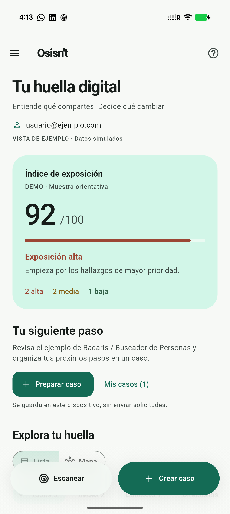
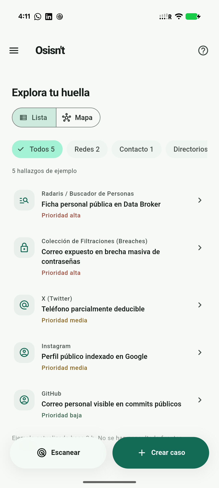
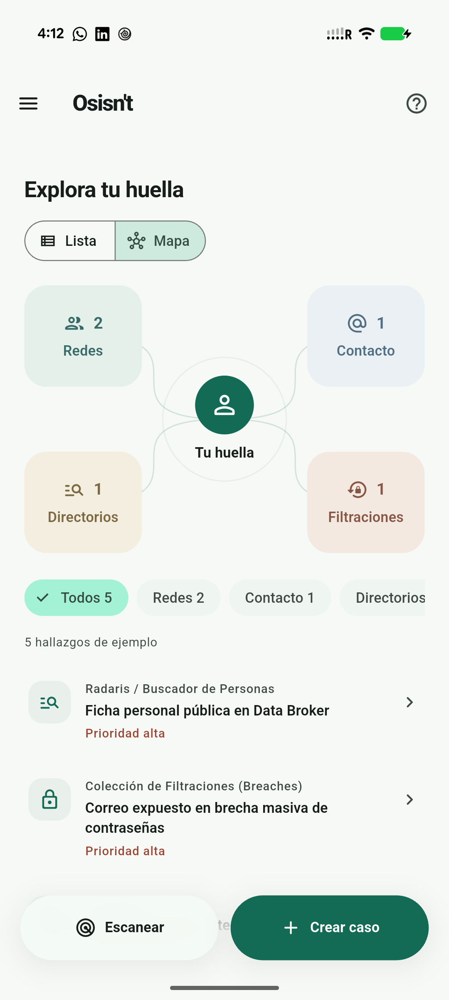
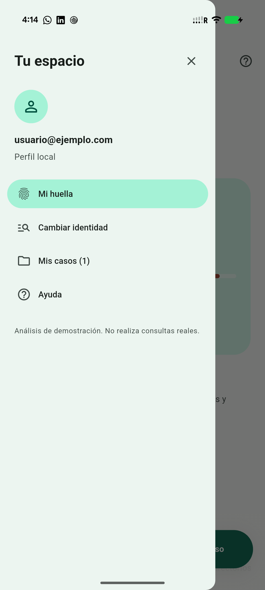

# Osisn't: revisión de producto y diseño móvil

Fecha: 9 de septiembre de 2026. Rama: `feature/osisnt-clean-mobile`.

## Referencia utilizada

Se revisó `/home/peterpad/Documents/FEEDocuments`; no se identificó allí otra versión de la app ni un mockup aplicable. La referencia pertinente encontrada fue [Osisn't: interfaz de huella digital](../../../documentation/osisnt-interfaz-huella-digital.md), contrastada con [el concepto de plataforma](../../../documentation/concepto-central-plataforma.md). Se solicitó aclaración de ruta y se avanzó con estos documentos al no recibir otra referencia durante la implementación.

| Idea o problema | Implementación |
| --- | --- |
| Diagnóstico comprensible y accionable | Inicio Osisn't, índice /100 y prioridades textuales; jerarquía más clara y menos bordes. |
| Dos botones inferiores desconectados | Una superficie inferior superpuesta con gradiente, una acción desenfocada y dos controles. El contenido se desplaza detrás y reaparece sobre el borde difuminado. |
| Perfil lateral | NavigationDrawer: identidad de la sesión, cambiar identidad, casos locales y ayuda. |
| Grafo visual | Vista Mapa opcional con categorías y conteos derivados del mismo perfil. Cada nodo abre la lista filtrada. |
| Demasiada información por tarjeta | Hallazgos resumidos en filas; explicación, datos y pasos en el detalle. |
| Remediación desde el hallazgo | Preparar caso con datos prellenados y almacenamiento local existente. |
| Backend todavía simulado | Inicio y hojas identifican los resultados de ejemplo. No se presentan como consultas reales ni retiros completados. |

No se implementaron motores OSINT, autenticación, verificación de identidad, eliminación de cuentas, envío de solicitudes ni limpieza EXIF. Estas funciones requieren integraciones adicionales. La identidad del ejemplo continúa en memoria durante la sesión; los casos usan el almacenamiento local existente.

## Implementación Flutter

Flutter 3.47.2 / Dart 3.13.2, Material 3 y dependencias existentes. La barra usa `Scaffold.bottomNavigationBar`, `extendBody`, `BackdropFilter` recortado a una acción, y una capa de gradiente que no intercepta gestos. La altura se deriva del texto y del ancho disponible. Respeta insets inferior/laterales, reduce movimiento y usa superficie opaca con alto contraste. El panel conserva controles de 48 unidades y adapta etiquetas largas. El mapa utiliza CustomPainter solo para conexiones decorativas y controles Material para interacción y semántica.

Referencias oficiales consultadas: [Material 3](https://docs.flutter.dev/release/breaking-changes/material-3-migration), [diseño adaptable](https://docs.flutter.dev/ui/adaptive-responsive/general), [BackdropFilter](https://api.flutter.dev/flutter/widgets/BackdropFilter-class.html), [movimiento reducido](https://api.flutter.dev/flutter/widgets/MediaQueryData/disableAnimations.html).

## Verificación

- Dependencias resueltas con `flutter pub get --enforce-lockfile`, sin actualización de paquetes.
- Formato de `lib`, `test` e `integration_test`: sin cambios pendientes.
- `flutter analyze --no-pub`: sin problemas.
- Suite completa: 102 pruebas pasaron. Tras el ajuste final de insets laterales, la suite específica del dashboard pasó sus 6 pruebas, incluida la nueva verificación horizontal.
- Casos existentes: pruebas de creación, edición, persistencia simulada, errores, archivo/restauración y borrado incluidas en la suite completa.
- Dashboard: 390 × 844 y 320 × 640 con texto al 200 %, último hallazgo alcanzable sobre la barra, navegación perfil → análisis con teclado, semántica, objetivos táctiles, contraste y movimiento reducido.
- Mapa: cuatro pruebas a 390/320 y texto 1×/2×, callbacks, conteos, contraste y controles.
- Panel: dos pruebas de cierre antes de navegar e identidad larga al 200 %.
- APK debug construido y ejecutado en Pixel 10 Pro XL, Android 17/API 37. Inspección visual nativa de inicio, desplazamiento, panel y mapa.
- Instalación mediante actualización `adb install -r`, sin borrar datos ni desinstalar. El contador continuó mostrando un caso local. Durante el arranque el plugin registró una advertencia de descifrado del almacenamiento anterior y utilizó su alternativa interna; no se modificó la configuración ni se ejecutó un reset.

Estas comprobaciones no equivalen a un recorrido de TalkBack/VoiceOver. No se ejecutó integración nativa de persistencia en esta entrega, no se evaluó rendimiento en modo profile ni se compiló iOS.

## Capturas del Pixel

